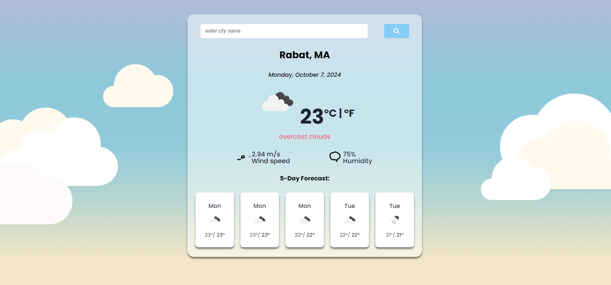

# React Weather App

This is a web app developed using React.js that allows users to search for the weather conditions of any city in the world and provides current weather information. The app fetches weather data from a reliable Weather API.

## Features
- Users can search for weather conditions of any city in the world.
- The app displays the current weather conditions, including temperature and weather description.
- The app utilizes a Weather API to fetch weather data.

## Technologies & Tools Used
- **React.js**: Frontend library for building user interfaces.
- **HTML**: Structure of the web app.
- **CSS**: Styling the app for better user experience.
- **JavaScript**: Programming language used for interactive elements.
- **Visual Studio Code**: Code editor for development.
- **Weather API**: API for fetching weather data.

## Installation and Usage
To get started with the app, follow these steps:

- Clone the repository or download the source code.
- Open the project in your preferred code editor.
- Run `npm install` to install the necessary dependencies.
- Run `npm start` to start the development server.
- Open your browser and navigate to `http://localhost:3000` to use the app.

To use the app, simply type the name of the city you want to search for in the search bar and press Enter. The app will display the current weather conditions for the searched city.

## Demo
A live demo of the React Weather App is available at [Live Demo](https://karempudikrishnamurthy.github.io/Weather_app_react/).

## License
This project is licensed under the MIT license.
